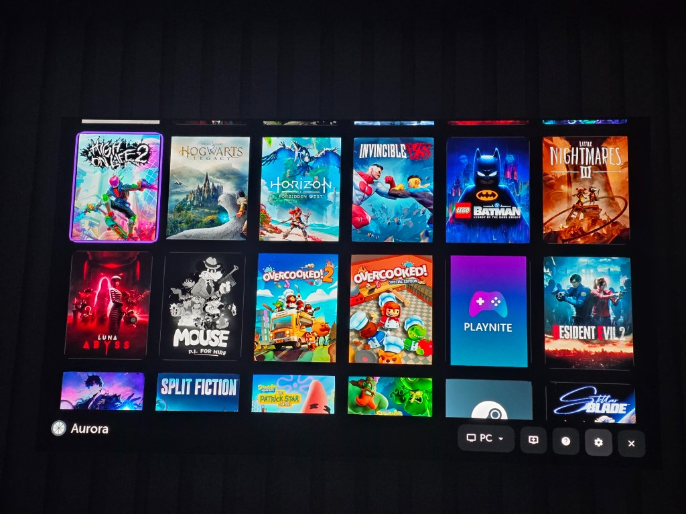
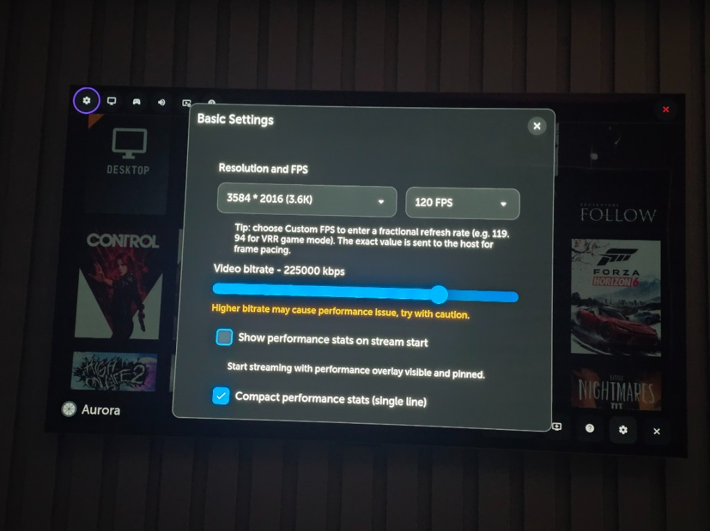
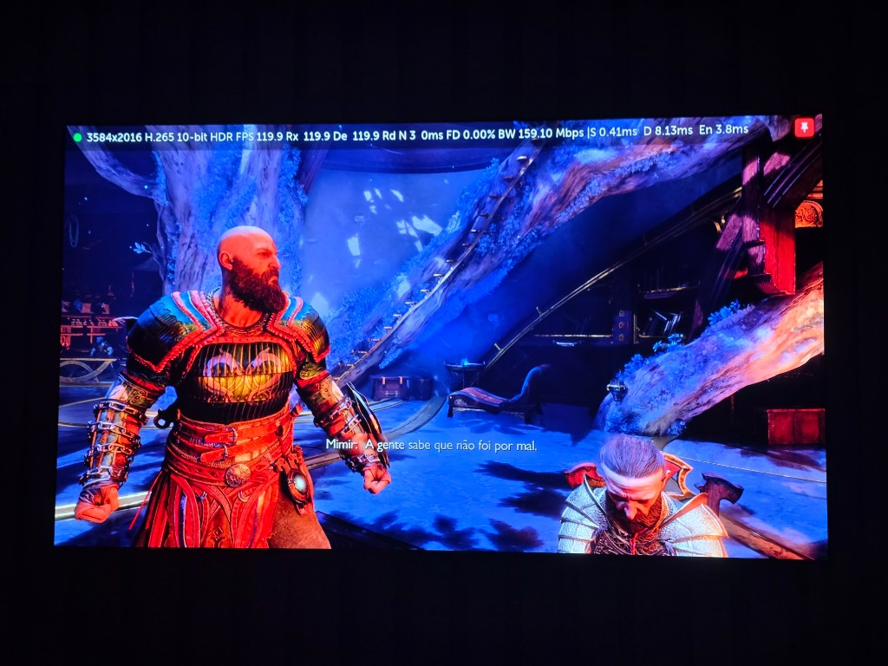
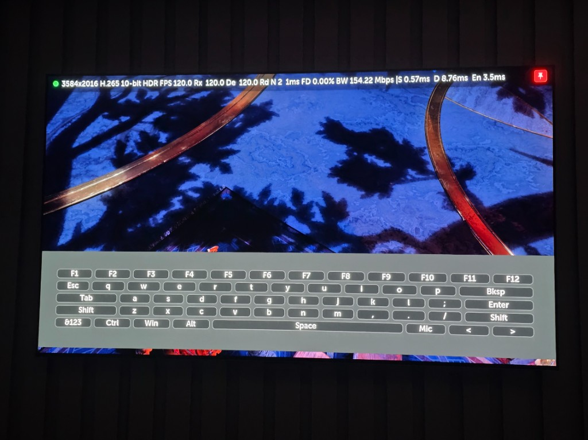
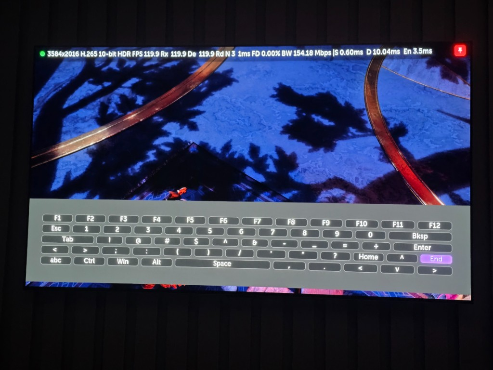

# Aurora

Unofficial fork of [Moonlight TV](https://github.com/mariotaku/moonlight-tv) for **LG webOS** (C1–C5 and compatible sets), focused on high-quality streaming on OLED TVs with a remote- and gamepad-friendly UI.

> Rights to the original project belong to [mariotaku/moonlight-tv](https://github.com/mariotaku/moonlight-tv) and the Moonlight community. Provided without warranty.

## Highlights

- **AMOLED layout** — pure black background, dark surfaces, violet accent.
- **3.6K (3584×2016)** — between 2K and 4K; strong quality with less decoder load than native 4K.
- **HDR10 (PQ)** over HEVC Main10 (when supported).
- Up to **300 Mbps** bitrate; **~270 Mbps** is a practical ceiling on stable 5 GHz Wi‑Fi for 3.6K HDR 120 Hz.
- **Performance stats overlay**, **full on-screen keyboard**, and **virtual mouse** during streaming.

## Screenshots

| Home | Settings |
|:---:|:---:|
|  |  |

| Performance stats | On-screen keyboard |
|:---:|:---:|
|  |  |

## Quick start

| Setting | Suggestion |
|---------|------------|
| Resolution | **3.6K** (3584×2016) |
| FPS | 60 or 120 |
| Codec | HEVC (H.265) |
| Bitrate | Start at **120–180 Mbps**; raise toward **~270 Mbps** on a stable link |

## Streaming controls

**Open overlay:** Magic Remote **RED** / **EXIT**, or gamepad **LB + RB + Back + Start** (hold, then release).

| Combo | Action |
|-------|--------|
| **RB + RS** | Full keyboard |
| **LB + RS** | Virtual mouse (enable in Settings → Input first) |
| **LB + LS** | Toggle pinned performance stats |

Full keyboard: **RB + RS**, overlay menu, or Magic Remote **BLUE**. Virtual mouse: right stick = cursor, left stick = scroll, LT/RT = mouse buttons.

Details, hotkey layout, and stats field reference: [webOS build guide](docs/BUILD_WEBOS.md).

## Install

- [webOS Homebrew Channel](https://github.com/webosbrew/webos-homebrew-channel) — repo: `https://raw.githubusercontent.com/GuiDev1994/aurora-tv/main/repo.json`
- [Device Manager](https://github.com/webosbrew/dev-manager-desktop) — install the latest `.ipk` from [Releases](https://github.com/GuiDev1994/aurora-tv/releases)
- [webOS TV CLI](https://webostv.developer.lge.com/develop/tools/cli-installation) — `ares-install com.aurora.gamestream_*_arm.ipk` ([build guide](docs/BUILD_WEBOS.md))

## Credits

- Base: [mariotaku/moonlight-tv](https://github.com/mariotaku/moonlight-tv)
- Components: [moonlight-embedded](https://github.com/irtimmer/moonlight-embedded), [moonlight-common-c](https://github.com/moonlight-stream/moonlight-common-c)
